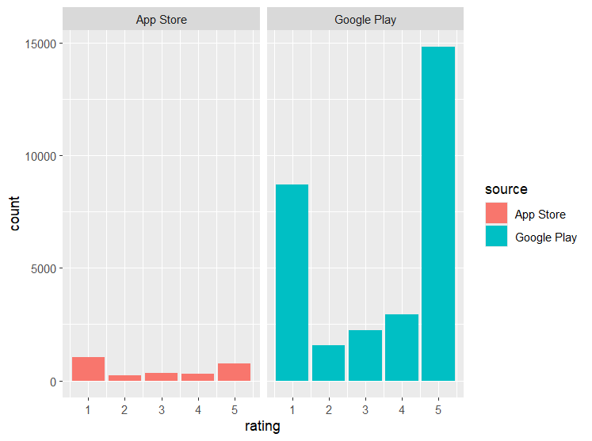
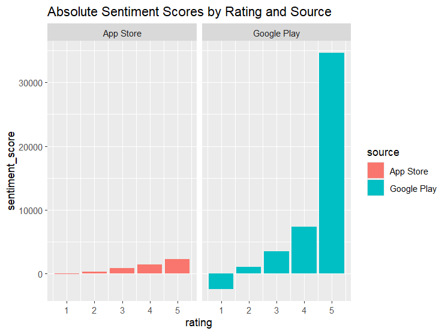
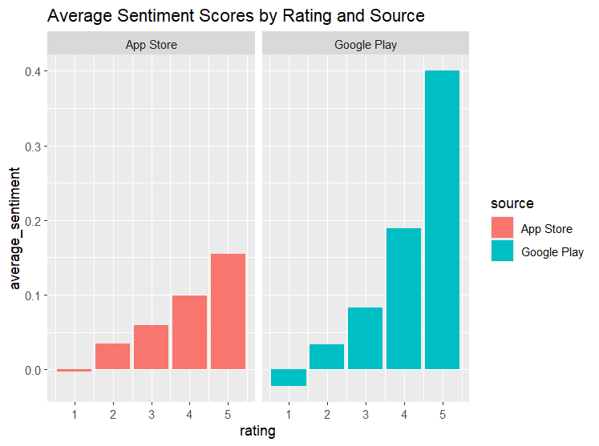
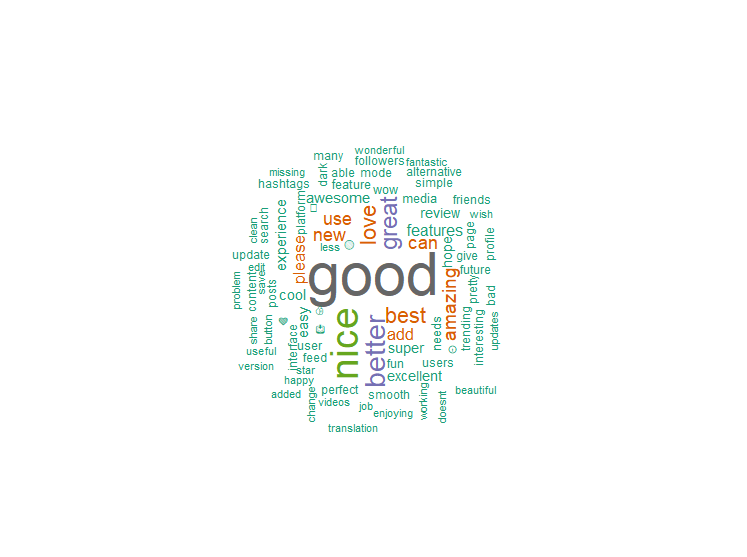
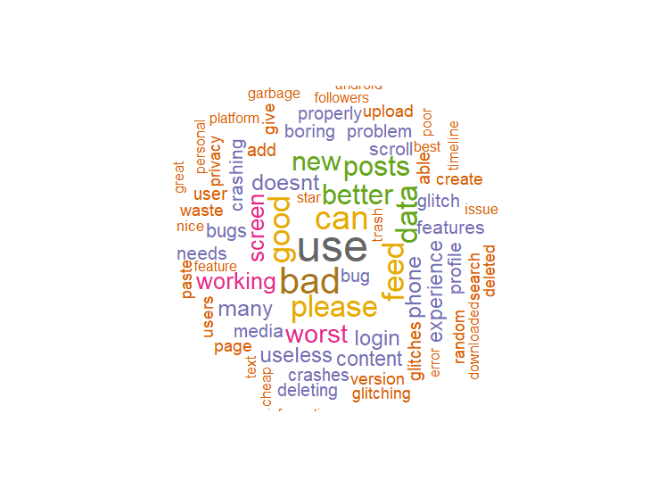
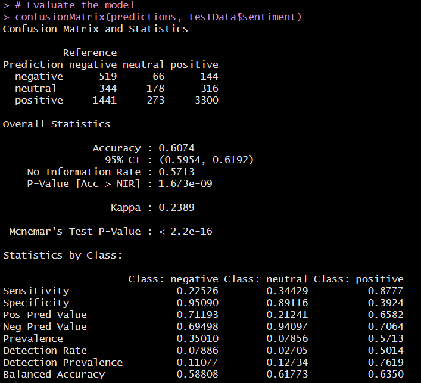
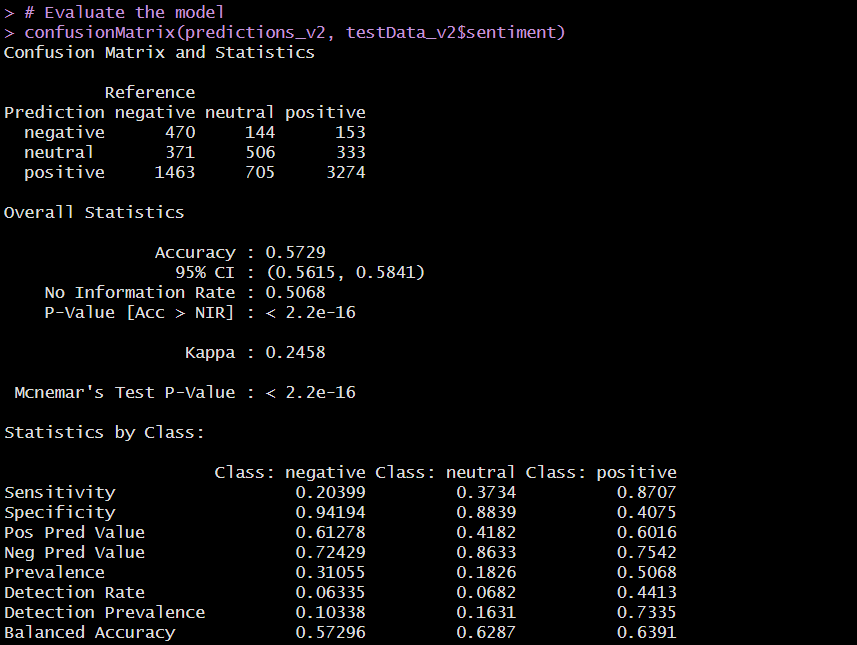
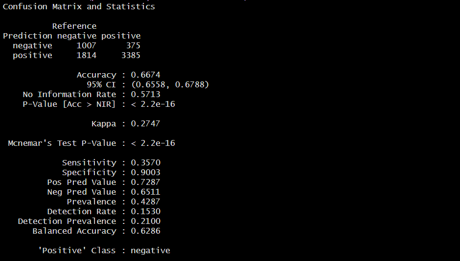
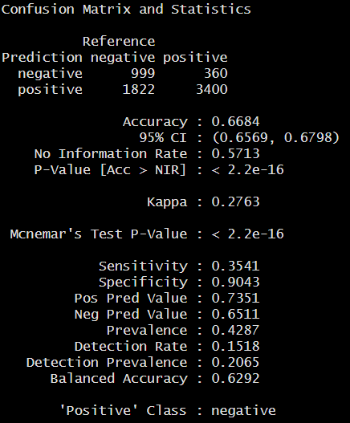

# "Threads" Sentiment Analysis

## Project Overview
This analysis dives into over 32,000 reviews of the "Threads" app from both the App Store and Google Play Store, aiming to uncover user sentiments and insights through sentiment analysis.

## Broad Insights
Platform-Wise Distribution of Ratings:
•	Initial observations indicate polarizing opinions, with ratings of '1' and '5' being the most common.
•	A notable disparity exists between the volume of reviews from Google Play Store compared to the App Store, which is considered a limitation of this analysis.

 
## Sentiment Scores
•	Approach: Utilized predefined lists from R packages to assign sentiment scores to reviews based on positive or negative word associations.
•	Findings: Ratings of '1' exhibit negative sentiment scores for Play Store reviews but show a positive (albeit close to zero) sentiment for App Store reviews. The variation suggests operating system-based differences in user perceptions, despite a skewed number of App Store reviews. However, this is impacted by the disparity in the much lower number of app store reviews compared to play store.

 

 
### Average Sentiment Scores
•	By normalizing sentiment scores against the total number of reviews per source, an average sentiment score offers a clearer view of overall user feelings towards "Threads".
•	We can now observe a more accurate trend that accounts for the lower number of app store reviews. The earlier observation about ratings of ‘1’ still stands, and we can more clearly notice that sentiment scores increase in much higher proportion for each increase in rating for play store reviews when compared to app store reviews. This points to high rated play store reviews being much more ‘glowing’ than high rated app store reviews.

  

## Key Word Observations:
•	Objective: To extend analysis beyond sentiment scores and ratings by identifying frequently used words in reviews.
•	Method: Utilized R's built-in algorithms and a manually curated list to exclude common "stop words" and app-specific terms like "twitter," "instagram," etc., to prevent skewed results due to lack of context. I then separated the data into two sets, one with low ratings (1-2) and another with high ratings (4-5). I then created word clouds out of the most commonly used words from each set.

### Positive Word cloud:
 
  

### Negative Word Cloud:  

 

## Predictive Models:
•	Goal: Leverage review data to build machine learning models capable of sentiment classification, potentially applicable to similar datasets.
•	Preprocessing Steps: Included converting text to lowercase, removing punctuation, numbers, and whitespace, and creating a Document Term Matrix (DTM) and calculating Term Frequency-Inverse Document Frequency (TF-IDF).
•	Defining ‘classes’: I have defined the classes based on ratings as follows:

data$sentiment <- case_when(
  data$rating >= 4 ~ "positive",
  data$rating == 3 ~ "neutral",
  data$rating <= 2 ~ "negative"

## Model Attempts:
### 1.	Initial Model: 
Achieved an accuracy of 60.74% but struggled with 'negative' and 'neutral' sentiment classifications due to class imbalance (there is a much higher proportion of positive reviews than any others).
 
 

### 2.	Adjusting for Class Sizes: 
Due to the previous issues, I checked the size of each class. They were as follows: 

size_negative <- 11522
size_neutral <- 2585
size_positive <- 18803

The difference between positive and negative was not so significant in this context (as we can presume from the reviews that threads was a fairly well received app according to reviews). However, the neutral class was very low. 

As a result, I oversampled the 'neutral' class. However, this did not improve model performance, reducing overall accuracy.
 
 

### 3.	Simplification to Two Classes:

Redefining ratings into 'positive' and 'negative' categories improved accuracy to 66.74%, with better specificity and precision but lower sensitivity for negative sentiments.

 

 
### 4. N-Grams: 
This problem of sensitivity could be due to ‘negation’ terms and the models inability to deal with them (example – a user could write ‘not good’ but the model would consider ‘good’ as a positive sentiment). 

A method to resolve that could be n-grams – where valuable context (like the one missing above) can be captured by pre-pending ‘negation’ terms like ‘not’ in the above context. Thus, the model becomes able to better deal with this nuance.
I tried a variety of n-gram models including using unigrams, bigrams, and trigrams, just unigrams and bigrams, and finally only bigrams, but attempting to run any of these models took too much of a toll on my local system to run.

### 5. Custom function for addressing Negation: 
To fix the above issue, I defined a custom function to handle negation by considering words following ‘not’ to become a single token with ‘not_’ as a prefix (example – “not_good” becomes a single token). 

This slightly improved precision for negative sentiments but reduced sensitivity, achieving a marginal overall performance increase to 66.84%.

  
  

## Conclusion:
This project highlighted the complexities of sentiment analysis, especially the challenges of class imbalance and the nuances of language processing. The evolution of models demonstrated iterative improvements in accuracy and underscored the potential for further refinement, especially in handling negations more effectively.

## Dataset Attribution:
This project uses the "Threads" App Reviews dataset, available under the Creative Commons Attribution-NoDerivs 4.0 International (CC BY-ND 4.0) license. The dataset was obtained from Kaggle and can be found here: https://www.kaggle.com/datasets/saloni1712/threads-an-instagram-app-reviews

Dataset Title: "Threads" App Reviews
Source: Kaggle
License: CC BY-ND 4.0
We adhere to the license terms by providing appropriate credit to the dataset creator, and this analysis is conducted for non-commercial purposes. No derivative work of the dataset itself is created or distributed as part of this project.
