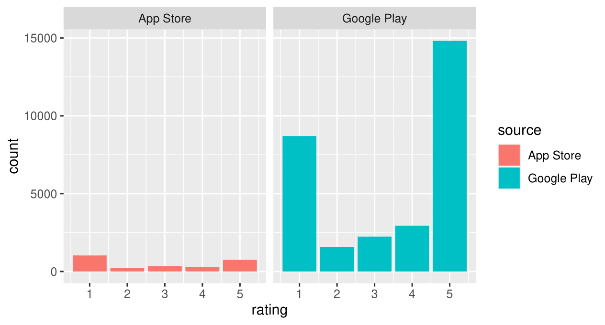
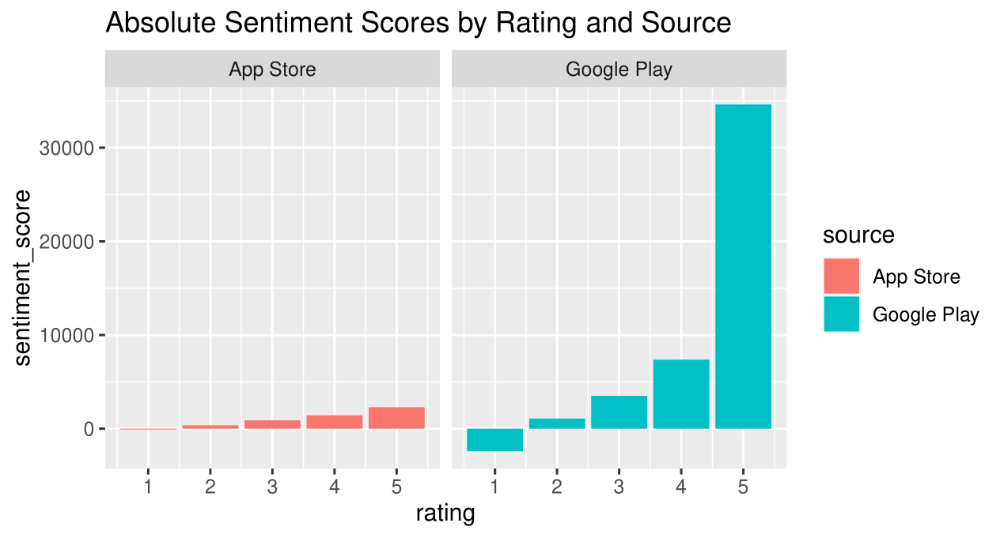
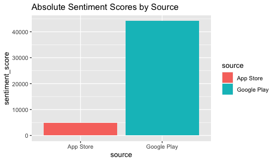
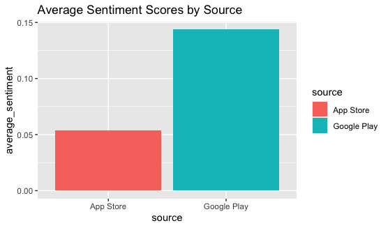
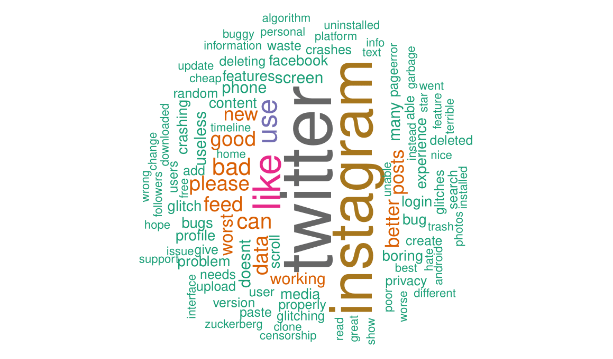
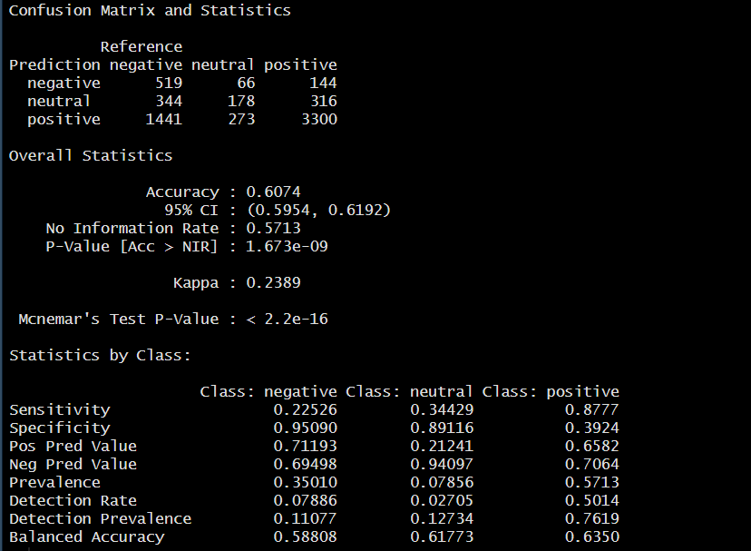
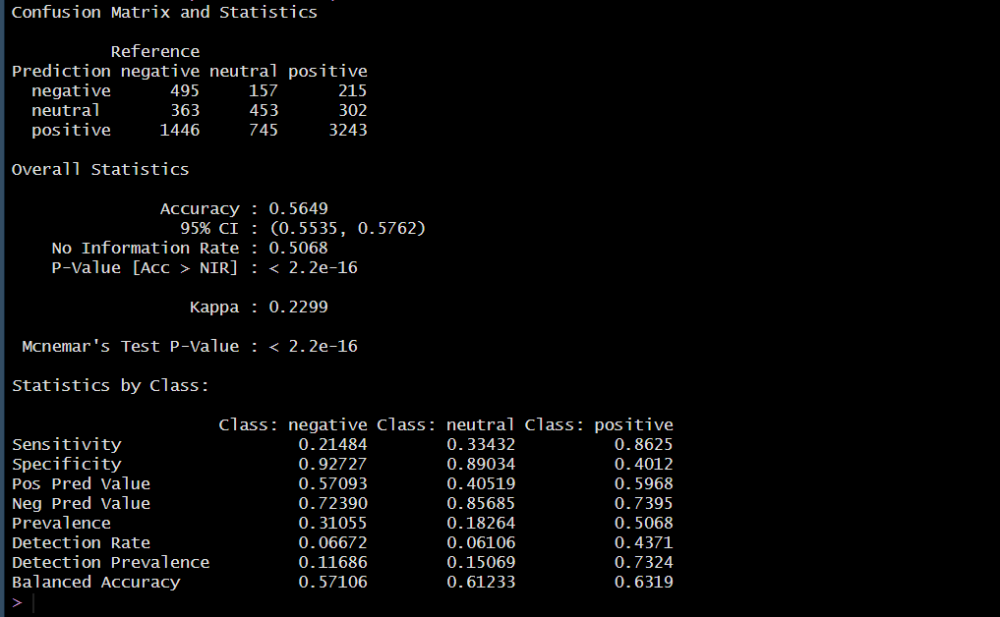
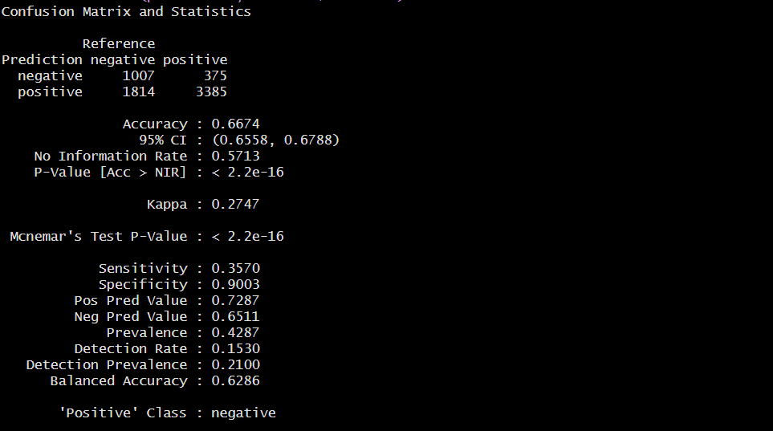
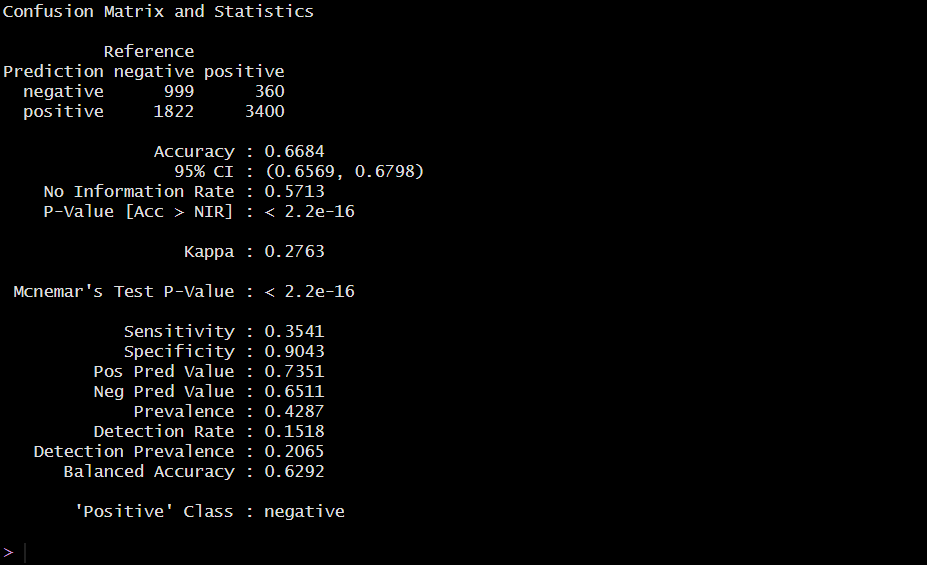

# "Threads" Sentiment Analysis

## Project Overview
This analysis dives into over 32,000 reviews of the "Threads" app from both the App Store and Google Play Store, aiming to uncover user sentiments and insights through sentiment analysis. (Add more about ML).

## Analysis Approach:

(I) Exploratory analysis - platform-wise distribution of ratings across these reviews.

(ii) Sentiment scores - Utilized predefined lists from R packages to assign sentiment scores to reviews based on positive or negative word associations.

(iii) Keyword Analysis

(iv) Machine Learning Models - Leverage review data to build machine learning models capable of sentiment classification, potentially applicable to similar datasets.

## Exploratory analysis:

### Platform-Wise Distribution of Ratings:

Initial observations indicate polarizing opinions, with ratings of '1' and '5' being the most common.
A notable disparity exists between the volume of reviews from Google Play Store compared to the App Store, which is considered a limitation of this analysis.

## Sentiment Scores

### Findings:

Ratings of '1' exhibit negative sentiment scores for Play Store reviews but show a positive (albeit close to zero) sentiment for App Store reviews.
The variation suggests operating system-based differences in user perceptions, despite a skewed number of App Store reviews.

### Average Sentiment Scores
By normalizing sentiment scores against the total number of reviews per source, an average sentiment score offers a clearer view of overall user feelings towards "Threads".

_Average_Sentiment_Scores_by_Rating_and_Source_1.png)

## Key Word Analysis

### Method: 
Utilized R's built-in algorithms and a manually curated list to exclude common "stop words" and app-specific terms like "twitter," "instagram," etc., to prevent skewed results due to lack of context.

### Findings: 
Words common to both positive and negative reviews include major social platforms, suggesting their use in comparisons.

Key Word Analysis for Positive Reviews (Reviews of rating 4 and above):

Key Word Analysis for Negative Reviews (Reviews of rating 2 and below):

## Machine Learning Models:

### Goal: 
Leverage review data to build machine learning models capable of sentiment classification, potentially applicable to similar datasets. Used the "naive_bayes" _.

### Preprocessing Steps: 
(I) Converting text to lowercase, removing punctuation, numbers, and whitespace

(ii) classifying different levels of ratings as follows:
 
  data$rating >= 4 ~ "positive",
  data$rating == 3 ~ "neutral",
  data$rating <= 2 ~ "negative"

(iii) Creating a Document Term Matrix (DTM)

(iv) Calculating Term Frequency-Inverse Document Frequency (TF-IDF)

(v) Splitting the data into 'training' and 'testing' sets - as is practice for all ML models of this type. 

(vi) In addition to the stop words in the keyword analysis, I have also taken the precaution of removing the words:  "twitter","instagram","facebook","zuckerberg". I have chosen to exclude these as they are widely used and common to both positive and negative reviews of the app, and could thus impact the predictive power of the model

### Model 1: Standard naive_bayes model

#### Results: Achieved an accuracy of 60.74% but struggled with 'negative' and 'neutral' sentiment classifications due to class imbalance.

### Model 2: Adjusting for class sizes via oversampling

#### Context: Here I will try to adjust for the lower number of negative and neutral reviews:

These are the sizes of each class and the overall average: 

size_negative <- 11522
size_neutral <- 2585
size_positive <- 18803
average_size <- 10970

I will ignore the negative class for now as neutral is drastically more under-represented by targeting halfway between its current size and the average:

target_size_neutral <- round((size_neutral + average_size) / 2)

The neutral class will now be oversampled:
data_neutral_oversampled <- sample_n(data_neutral, target_size_neutral, replace = TRUE)

#### Results:

### Model 3: Simplification to Two Classes

#### Context: 
The classes have been redefined to: 

  data$rating >= 4 ~ "positive",
  data$rating <= 3 ~ "negative"

#### Results: 
Redefining ratings into 'positive' and 'negative' categories improved accuracy to 66.74%, with better specificity and precision but lower sensitivity for negative sentiments. This could demand a more sophisticated treatment of negative class in the data.

### Attempt 4: Addressing Negation

#### Context:
One way to achieve a better model is the utilization of n-grams. An n-gram is a collection of n-succesive words which can add further context and help in model performance. For instance, the word "good" would have been present in many negative reviews being paired with "not" (as in - "not good"). Using n-grams, I can account for this kind of "negation" context when it comes to negative reviews.

I tried a variety of n-gram models including using unigrams, bigrams, and trigrams, just unigrams and bigrams, and finally only bigrams, but attempting to run any of these models took too much of a toll on my local system to run successfully.

Thus, I have tried to account for this negation problem in the least computationally intensive way I can think of - by handling terms like 'not' by treating it like a single word attached to the next word in the review:

handle_negation <- function(text) {
  text_modified <- gsub("not (\\w+)", "not_\\1", text)
  return(text_modified)
}

#### Results:
While only slightly better than our previous model (at 66.84%), this one gives us our best overall performance yet. Precision for negative sentiments shows a slight improvement, indicating a minor increase in the accuracy of negative sentiment predictions, but sensitivity for negative sentiments shows a slight decrease from 35.70% to 35.41%, indicating a marginal reduction in the model's ability to correctly identify negative sentiments.

