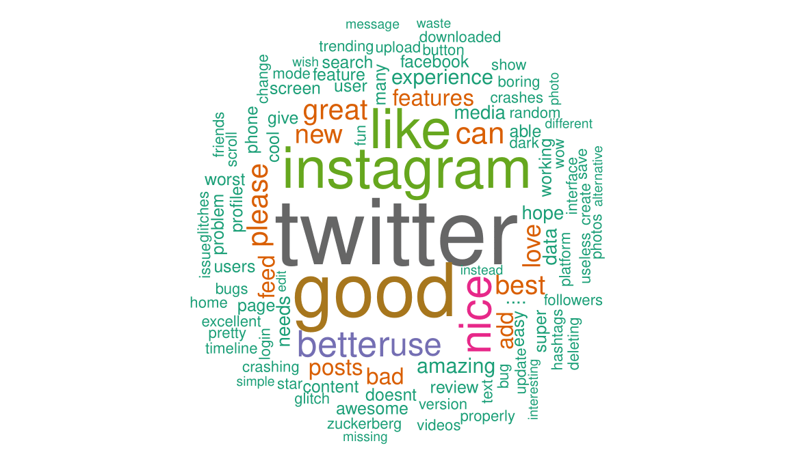
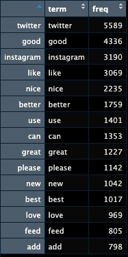
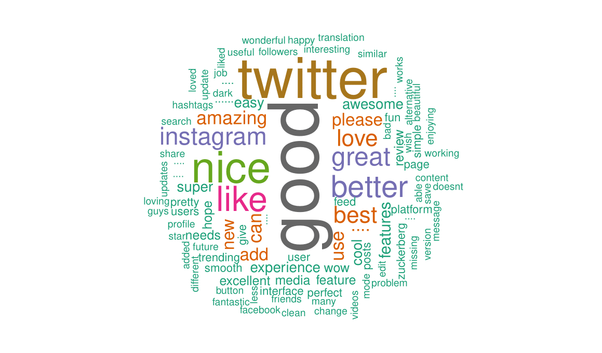
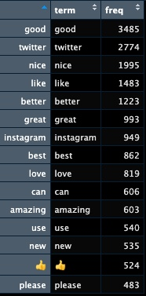
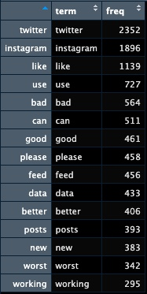
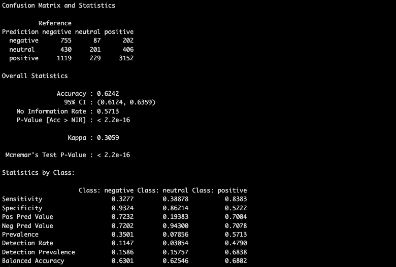

# Threads sentiment-analysis

This is a sentiment analysis of a set of over 32k reviews on the 'Threads' app across both the App and Google Play Store.

### Broad Insights 

First off, I wanted to check the distribution of ratings (looking at this platform-wise allows an extra degree of insight)

The reviews do seem to be quite polarizing with '1' and '5' being the most frequent.

We have significantly more Google Play Store reviews than App Store reviews which could impact the overall analysis, so we will consider this one of our limitations going forward.

### Sentiment Scores

A great way to get an idea of how users feel about 'Threads' in their reviews is deriving a 'sentiment score' for them. The sentiment scores here come from _. Put very simply, obtaining these involves 'tokenising' the reviews (a process where _), followed by _, and then finished up by _

While you can see viewing the sentiment scores by their numerical ratings as too obvious to reveal anything significant, it is interesting to note how a rating of '1' corresponds to a negative sentiment score for Play Store users, but remains positive (though close to 0) for App Store users.

Of course, the difference between users of each of the two operating systems can result from the limited number of App Store reviews.
To counteract this, we can try to get a clearer picture of how users feel about 'Threads' via an 'average' sentiment score. These averages are _ from _.

_Average_Sentiment_Scores_by_Rating_and_Source_1.png)

### Key Word Analysis

Keyword analysis is a great way to expand our analysis beyond sentiment scores and numeric ratings. I have pulled up the most commonly used words appearing in all of the reviews. of course, prior to this, I have tried my best to remove any 'stop words' (words which don't _) through both _'s _ and a list I created myself manually after viewing the most commonly used words.

The word cloud format is a great way to view the results, though I do find it overwhelming sometimes, so a table of the top words could be a great supplement.

##### Key Word Analysis for Positive Reviews (Reviews of rating 4 and above)

##### Key Word Analysis for Negative Reviews (Reviews of rating 2 and below)

### Predictive Models and Beyond

We can use this data to create machine learning models for sentiment classification that can potentially be used to predict values on other such datasets of app reviews!

After performing text vectorization, I can split my dataset into testing and training groups and run an ML algorithm. I am trying the Naive Bayes algorithm first.

Evaluating the model's performance using the test set, I can see it performs alright. It has an accuracy of 62.42% which is better than the no information rate (baseline accuracy that could be achieved by always predicting the most frequent class) of 57.13% but this is not too much of an improvement. The p-value and kappa statistic also indicate the model does perform better than chance for certain.

Class-wise (positive, neutral, and negative reviews) reveals that that model actually performs quite well for positive reviews, but not so much for negative and neutral reviews.

There can be some ways for me to improve this:

